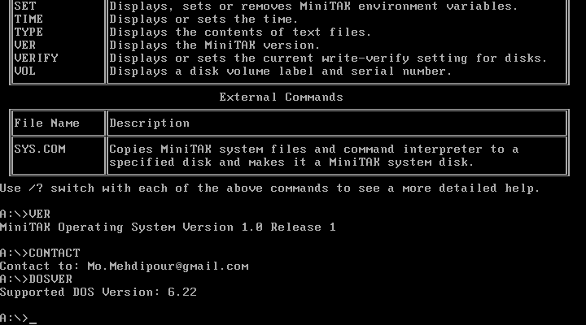

# MiniTAK Operating System

MiniTAK is a small operating system for x86 computers to run in processor real mode. One of the main goals in designing and developing this operating system was to be fully compatible with MS-DOS operating system and its application programs.
To minimize the size of this operating system, it is completely written in assembly language and can boot on any 8088 compatible processor.
This project is an attempt to develop an optimized operating system which can be used to replace MS-DOS, adding new modern features.
This operating system is completely written by me in 2004, as a result of about 5 years full research and development. And now in 2014, I want to publish it to the world. This operating system supports FAT12 file system, and allow to run many MS-DOS applications.

Some images from the operating system in operation:

About:

Startup message after boot:

Help:

DIR and TYPE commands:

Bootable CD Image:

MS-DOS text editor executed inside MiniTAK operating system:

